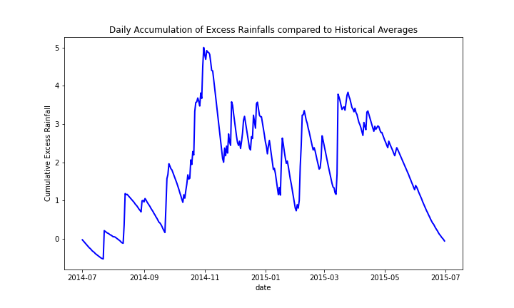
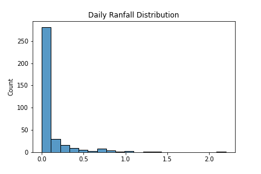
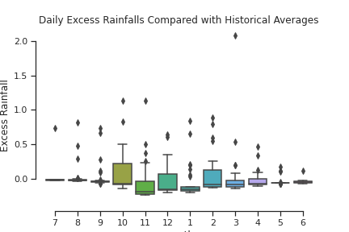
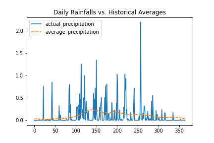
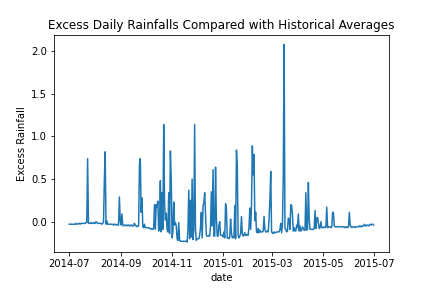

# EXCESSIVE RAINFALLS IN STEATTLE 2014-2015

This project analyze weather data provided by the FiveThirtyEight public data repository. I first discuss an objective for the project and report the main results from my visual analysis of the data. I then discuss how I clean and visualize the data with detailed explanation on the choices I made in the process. Last, I discuss how to improve on the project if time permits.

## Objective

My objective is to summarize a dataset of annual, daily precipitation in Seattle, WA during the one-year period starting in July 2014. To create a meaningful narrative of the data, I believe that it is important to first think about for whom and what purpose the data would be used even if this is mainly intended to be a technical excerise. This purpose helps me choose the most optimal visualization tool and articulate my choice transparently.

Washington is world-famous for its apple orchards. I'd imagine that my client is an apple farmer for whom the volumns and durations of rainfalls - or lack thereof - are critical for growing, caring and harvesting apples. Unlike temperature, rainfalls accummulate in the ground. Thus, my client would be less interested in specific days of rainfalls and more interested in the cummulative amount of rain as the year goes by: when it starts, how much it adds up, and how long it occurs. For example, excessive rainfalls in the spring could delay seeding/planting. Conversely, arid summers could harm plant growth. The ability to plan for these periods could improve my client's business bottomline.

Furthermore, my client has experience with climate and weather in the area. My goal is not to educate them about the natural environment of Seattle. I would better serve them by highlighting on the *unusual* changes in the rainfall pattern that 2014 brings.

## Results

The figure that best summarizes rainfalls pattern in Seattle for the one-year period starting in July 2014 is the chart below. Hereby, inch is the unit for all visualization in the project.

To construct this chart I first calculate the amount of daily rainfall *in excess of* daily historical averages. For each bar in the chart, I calculate the monthly average of excess rainfalls for all the days in each month. The chart reveals a number of important patterns from the data:

- The fall period between August and November was exceptionally wet, even compared to Seattle's fabled rainy days. Rainfalls continued to accumulate throughout the perod to a peak at the end of November.

- The early winter period between December and January was much drier than normal, offsetting nearly all the excess rainfalls of the fall.

- The spring period started out with 2 months of heavy rainfalls but became dry starting in April.

- The following summer months stayed excessively and steadily dry into July.

A less visually appealing but more accurate visualization of the main themes above could be the monthly chart below:

I note that, the end of the period, cumulative amount of rainfalls was nearly 0. This means that the sum of all excess rainfalls over the year was little above or below annual average. The benefit of this cummulative chart is that it enables us to determine the starting points of dry/wet periods based on actual rainfall observation rather than arbitrarily based on start dates of the month.

Overall, 2014 was divided into wet fall and spring periods and dry winter and summer periods. Even though accumulative excess/shortfall between the periods offset each other nearly completely over the year, the excessive deviation from historical averages implied that rainfall-sensitive businesses such as my client needed to prepare adequately.

## Technical notes on data cleaning and visualization

The most distinct characteristic of daily rainfall data is its lack of continuity, containg many days of completely driness, peppered with a sporadic days of excessive rainfalls. We can see this characteristic in a histogram or a monthly box plot as below:

The box plot shows that there are a few days of excessive rains nearly eevry month of the year. For gardening purpose, these rainy days - their requency and volumns - can be very important since they bring the the lion share of the percipitation volumn of the year. Thus, in visualize this data set, I find it important to be able to capture both the underlying trend in the data (is this year dry or wet?) and the influence of exceptional days on that trend (when does accumulation start? How long does it go on? When does it stop?).

The most straight forward way to decompose the "signal" from the "noises" is by comparing with historical averages. The chart below carries out this comparison. The method simply does not work because of the extreme day-to-day volatility of rainfalls.

To construct the final graphs I use for the result section, I first calculate daily excess rainfalls by subtracting historical percipitation from actual percipitation. As the plot below show, the problem of high volatility remains, which prevents me to extract any meaningful themes from the data.

For the final two charts in the result section, I reduce the volatility of the data by two different aggregating techniques; one by averaging, the other by accumulating. Even though I prefer the accumulative chart personally for its accuracy, completelness, and richness in details. I choce the monthly average due to its visual appeal. Even if my client is to forget everything else about the data, the chart would still help remind them of the most important facts: the months when the excessive rain starts and when it ends.

## Directions for improvement

I can use this data to detect and report specific periods of drought and continuous excessive rainfalls. This capability could add value to the project by giving the client accurate timing information on which they could plan specific business actions.

For example, a drought is defined as a streak of at least n days with p inches or lower daily percipitation, depending on specific regions. I wrote a simple code at the end of my jupyter notebook to identify drought periods in Seattle of at least 20 days of 0.1 inch of percipitation or lower. Surprisingly, there were two: both are in the summer and add up to a grand total of 0.6 inch of rain.

Conversely, I could find excessively long periods of rainfalls and calculate the accumulative amount of rain they add. Visualizing such events can be very helpful for comparison year over year and area over area. (Here's an example of such a visualization: <https://dataviztoday.com/shownotes/23>) It could be done - at the most abstract level with boxes for which length represent duration and height represent average daily rainfalls. I studied the techniques to draw such boxes with matplotlib and altair but ultimately decided that they are beyond the time expectation for this project.
